Part 01
===

For this first week we will focus on the basis. We will be looking at the core functions of p5.js, and some simple useful maths technics. We will also experiment with shapes, patterns and agents (intelligent and non intelligent). We will then learn how color spaces are created and how to generate them dynamically.

# Setup & Basis

## Github

You should have received a link for the github classroom page, please clone this repo on your computer. This will be the main repo to keep all the work done in this class. At the end of the workshop this will serve as a portfolio of your work as creative coder ;). You can work on experimental sketch locally, once you are satisfied you can then push them to your classroom repo.
(add file structure img here)

## p5.js environment setup

It is recommended to setup p5js locally, you can follow this detailed [guide by Daniel Shiffman](https://www.youtube.com/watch?v=HZ4D3wDRaec) to setup your env if you like. Steps are:

- Install node (or other webserver)
- If using node install p5-manager *(optional)* to quickly generate project
- Run local server
- Play

## Processing + libs

Please install processing from this [link](http://www.processing.org) you can then install all libraries required.

## P5.js basis

Since you have used Processing in a previous class you should be familiar with p5.js commands. If you are not confortable yet with P5.js you can go through this list of tutorials / guides:

- [P5 Learn](https://p5js.org/learn/)
- [P5 Wiki](https://github.com/processing/p5.js/wiki/)
- [Creative Coding](https://creative-coding.decontextualize.com/)
- [Shiffman's Foundation of programming in js](https://www.youtube.com/playlist?list=PLRqwX-V7Uu6Zy51Q-x9tMWIv9cueOFTFA)
- [P5js reference](https://p5js.org/reference/)

Feel free to take some time to play and try things before getting started with the class.

## Vector Maths

A vector is a collection of values that describe relative position in space. [^note-id1]

Before we get into vectors themselves, let's look at a beginner Processing example that demonstrates why it is in the first place we should care. If you've read any of the introductory Processing textbooks or taken a class on programming with Processing, you probably, at one point or another, learned how to write a simple bouncing ball sketch. 

<!-- Bouncing ball no vectors -->

See the Pen <a href="https://codepen.io/gu-ma/pen/QOOQXK/">p5.js vector (no) math 02</a> by G. (<a href="https://codepen.io/gu-ma">@gu-ma</a>) on <a href="https://codepen.io">CodePen</a>.

We can replace

`var x, var y;`  
`var xspeed, var yspeed;`

By 2 vectors:

`vector position,`  
`vector speed;`

Vectors aren't going to allow us to do anything new. Using vectors won't suddenly make your Processing sketches magically simulate physics, however, **they will simplify your code** and provide a set of functions for common mathematical operations that happen over and over and over again while programming motion. 

So the underlying data for both position and velocity, in the bouncing ball example, would be the following:

`position --> x,y`  
`velocity --> xspeed,yspeed`

### Vectors: Operations

The sketch below show a typical vector substraction with normalization and scaling.

<!-- Basic vector math: subtraction, normalization, scaling -->

See the Pen <a href="https://codepen.io/gu-ma/pen/oooEod/">p5.js vector math</a> by G. (<a href="https://codepen.io/gu-ma">@gu-ma</a>) on <a href="https://codepen.io">CodePen</a>.

> Both addition and subtraction with vectors follows the same algebraic rules as with real numbers. 
> The commutative rule: u + v = v + u  
> The associative rule: u + (v + w) = (u + v) + w  
> The fancy terminology and symbols aside, this is really quite a simple concept. We're just saying that common sense properties of addition apply with vectors as well.  
> 3 + 2 = 2 + 3  
> (3 + 2) + 1 = 3 + (2 + 1)

Example of the bouncing ball rewritten with vectors:

<!-- Bouncing ball with vectors -->

See the Pen <a href="https://codepen.io/gu-ma/pen/JOOLQP/">p5.js vector math 03</a> by G. (<a href="https://codepen.io/gu-ma">@gu-ma</a>) on <a href="https://codepen.io">CodePen</a>.

___

> [Processing tutorial on vectors](https://processing.org/tutorials/pvector/)  
> [References (p5js) for vector operation](https://p5js.org/reference/#/p5.Vector)   

**✎ Going further: build a particle class which includes position, velocity, gravity and friction**

# Shapes 

A shape is the form of an object or its external boundary, outline, or external surface, as opposed to other properties such as color, texture, or material composition. 

Max Bill was a Swiss designer who created the Allianz group of Swiss artists in 1937 with other Swiss artists. The group adopted a formalist aesthetic and considered a work of art as an **autonomous system of meaning free signs**. They sought to create forms which visually represent the New Physics of the early 20th century and to create objects that could be understood by the senses: that is as a concrete art. He was among the first artist to introduce algorithms in his work.

> "The "hand" of the artist may be difficult to detect in finished works of concrete art; concrete art may appear, in some instances, to have been made by a machine." [^note-id2]

## ✎ Experiment-01

Try to create some sketch replicating some of the "effects" used in Max Bill (or other artists) artworks. Add some interactivity.

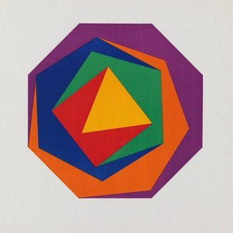 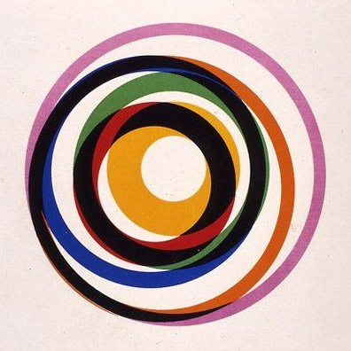

Do not focus on colors for now, it is recommended to do this sketches in black and white. But please feel free to add colors if you like!

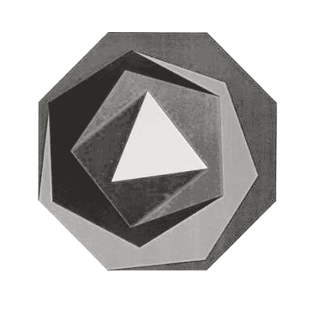 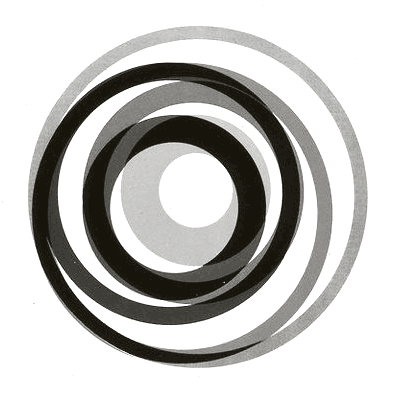

## ✎ Experiment-02

Try to recreate some of the effects below. Add some interactivity (mouse, keyboard, etc...)

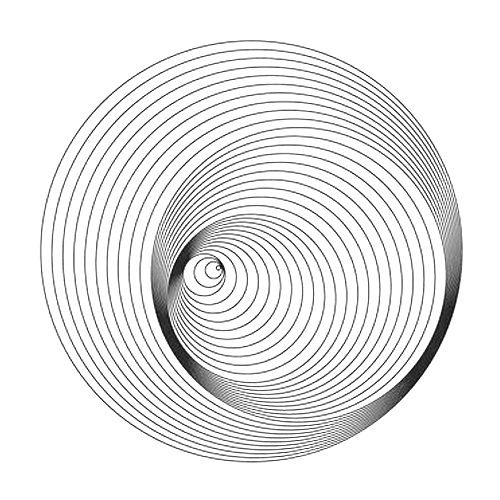 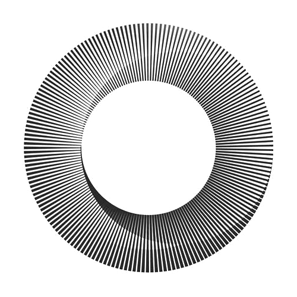 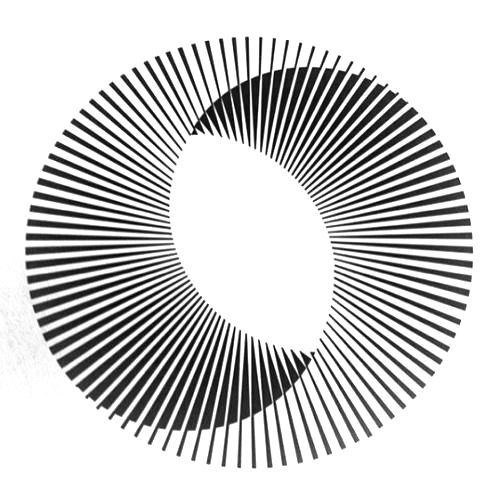

**✎ Going further: try to replicate more artworks from Max Bill's serie [fifteen variations on a single theme](https://rulesbased.wordpress.com/2010/09/08/fifteen-variations-on-a-single-theme/)**

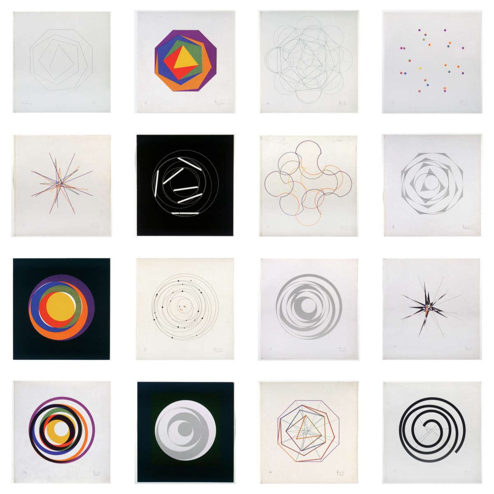

> You will find code examples in the main github-repo in the folder `examples/01-...` `examples/02-...`  
> [Generative Gestaltung (P_2_0)](http://www.generative-gestaltung.de/2)  

# Patterns

A pattern is a discernible regularity in the world or in a manmade design. As such, the elements of a pattern repeat in a predictable manner. A geometric pattern is a kind of pattern formed of geometric shapes and typically repeated like a wallpaper. 

In this section we are going to take a closer look at one particular type of patterns: Tessellations. Tessellation, or tiling in two dimensions, is a topic in geometry that studies how shapes, known as tiles, can be arranged to **fill a plane without any gaps, according to a given set of rules**. There are many forms of tesselation and you are invited to read some of the wiki pages below to learn more about each of those tesselation technics:

- [Tesselation](https://en.wikipedia.org/wiki/Tessellation)
- [Euclidian tilings](https://en.wikipedia.org/wiki/Euclidean_tilings_by_convex_regular_polygons)
- [Edge tesselation](https://en.wikipedia.org/wiki/Edge_tessellation)
- [Penrose tiling](https://en.wikipedia.org/wiki/Penrose_tiling)
- [Patterns](https://en.wikipedia.org/wiki/Pattern)

## ✎ Experiment-03

Try to recreate some of the patterns below, add interactivity. **Start simple then complexify your system gradually.**

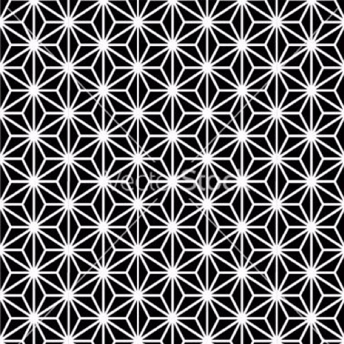  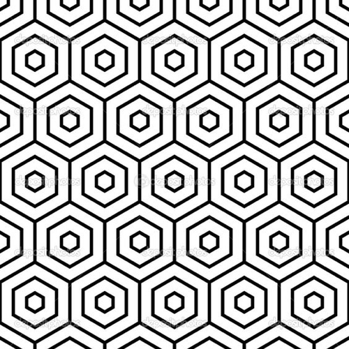 
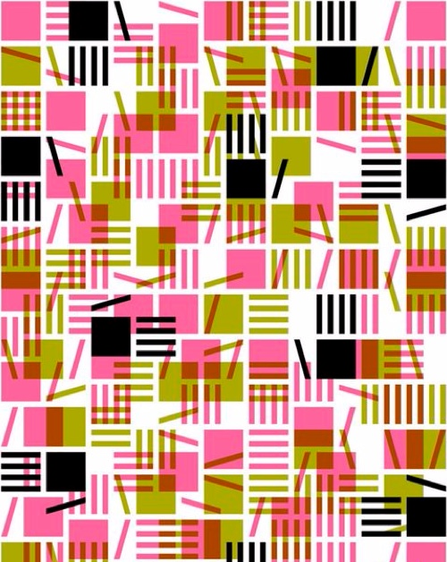 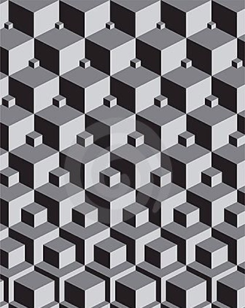 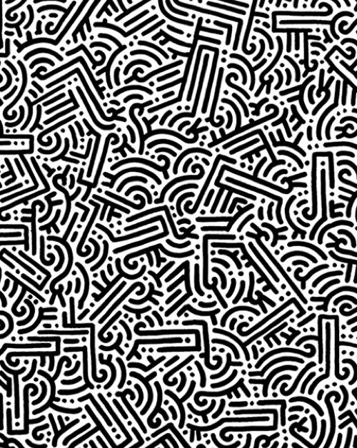

___

> You will find code examples in the main github-repo in the folder `examples/03-...`  
> [Generative Gestaltung (P_2_1)](http://www.generative-gestaltung.de/2)  
> 🌟 [Pinterest pattern board](https://www.pinterest.ch/9uill0m/generative-class/patterns/)   *(temp pinterest account: tmp.pin@gmail.com / TT4[bosses )*  
> [Escher tesselations](https://duckduckgo.com/?q=escher+tessellations&t=ffab&iar=images&iax=images&ia=images)

**✎ Going further: add offseting, states, transform your pattern, add noise / random parameters, add sketchiness, take it to the 3rd dimenssion...**

# From patterns to agents

Before we start working on agents let's have a look at a fun little command line code originally written in Basic on the C64 in the early 80's:

`10 PRINT CHR$(205.5+RND(1)); : GOTO 10`

Even though the code in itself is similar to the algorithms that generate patterns we explored before; With certain settings the visuals it produces are quite similar to outputs generated by intelligent agents programs.

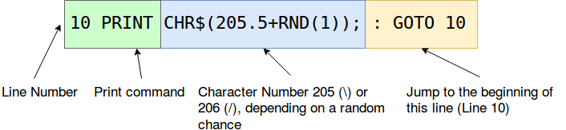

## ✎ Experiment-04

Recreate a  version of 10print in p5.js and create some variations

___

> You will find code examples in the main github-repo in the folder `examples/04-...`  
> [#10print on Twitter](https://twitter.com/hashtag/10print)  
> [10 print book](https://10print.org/)

# Agents

## Non intelligent & Intelligents agents

There are two essentially different patterns that generative models follow. Let’s call these tentatively **the evolutionary pattern** and the **self-organisational pattern**. In models following the **evolutionary pattern** the full design sequence typically involves modelling, analysis and interpretation. When this sequence is closed and the information from design analysis is fed back into the modelling procedure, the feedback loop is formed and the model becomes generative. 

The **self-organisational models** feature feedback loops that takes place between design agents and the modelled environment. During the design process, the agent evaluates its environment and makes some changes to it. The changes in the environment constantly trigger new actions which, in turn, cause further changes. This type of feedback loop can be used for creating highly dynamical systems of design.[^note-id3]

Evolutionary processes are mainly concerned with adaptation and optimization as opposed to generative processes where the outcomes are not necessarily the best solutions.

## ✎ Experiment-05

Try to recreate some of the visuals below. Have a look at the "example" folder in the main repo, there you will find some simple examples of intelligents and non-intelligents agents. There are also plenty of code examples availables in the links provided at the end of this chapter as well as some visual references in the main pinterest board. As usual try to add some interactivity to your code! 

Once you're done creating stupid agents, add a set of rules to them to create self-organisational models. Add interactivity and try to generate unexpected results ;)

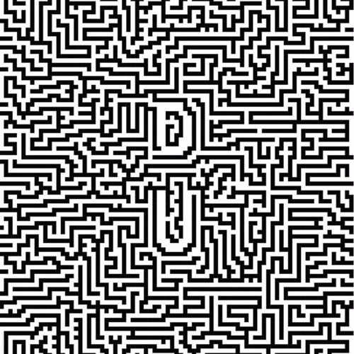 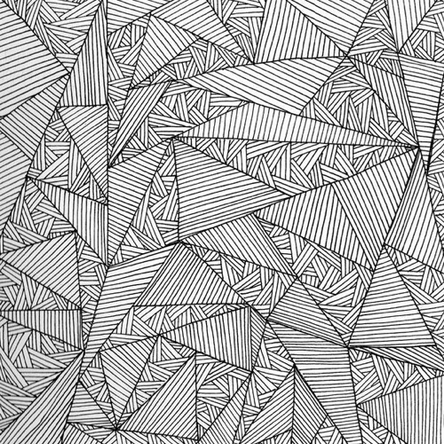

## ✎ Experiment-06 | Shapes made out of agents

In this experiment you will combine what you've learned in the section on patterns and tesselation with some of the technics you've developed coding the agents before.

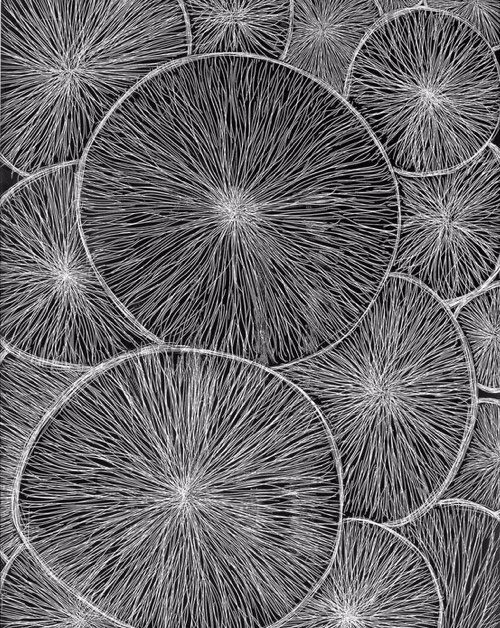 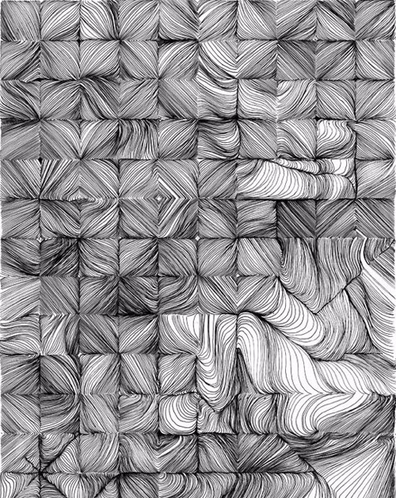

## Growing agents

ADD DEFINITION + EXAMPLES HERE

___

> You will find code examples in the main github-repo in the folder `examples/04-...`  
> [Generative Gestaltung (P_2_2)](http://www.generative-gestaltung.de/2)  
> 🌟 [Pinterest agents board](https://www.pinterest.ch/9uill0m/generative-class/agents/)   *(temp pinterest account: tmp.pin@gmail.com / TT4[bosses )*  
> [Jared Tarbell repo](https://github.com/jaredtarbell?tab=repositories)  
> [Inconvergent posts](http://inconvergent.net/generative/)  

**✎ Going further: add more complex rules, add noise / random parameters, add sketchiness, take it to the 3rd dimenssion...**

[^note-id1]: [processing tutorial on vector](https://processing.org/tutorials/pvector/)
[^note-id2]: ["Concrete art"](http://moca.org/pc/viewArtTerm.php?id=12). MOCA/Museum of Contemporary Art, Los Angeles 
[^note-id3]: ["What is Generative Design?"](https://prezi.com/jgqqkltjp1yx/what-is-generative-design/)
