> “In visual perception a color is almost never seen as it really is - as it physically is. This fact makes color the most relative medium in art.”   
> _Josef Albers (1963), Interaction of Color_

# Colors

## Color Recollection – Visual Memory [^note-id1]

If one says “Red” (the name of a color) and there are 50 people listening, it can be expected that there will be 50 reds in their minds. and one can be sure that all these reds will be very different.

Even when a certain color is specified which all listeners have seen innumerable times—such as the red of the Coca-Cola signs which is the same red all over the country—they will still think of many different reds.

Even if all the listeners have hundreds of reds in front of them from which to choose the Coca-Cola red, they will again select quite different colors. And no one can be sure that he has found the precise red shade.

And even if that round red Coca-Cola sign with the white name in the middle is actually shown so that everyone focuses on the same red, each will receive the same projection on his retina, but no one can be sure whether each has the same perception.

When we consider further the associations and reactions which are experienced in connection with color and the name, probably everyone will diverge again in many different directions.

**What does this show?**

First it is hard, if not impossible, to remember distinct colors. This underscores the important fact that the visual memory is very poor in comparison with our auditory memory. Often the latter is able to repeat a melody heard only once or twice.

Second, the nomenclature of color is most inadequate. Though there are innumerable colors —shades and tones— in daily vocabulary, there are only about 30 color names.

## Color models

A color model is an abstract mathematical model describing the way colors can be represented as tuples of numbers, typically as three or four values or color components. When this model is associated with a precise description of how the components are to be interpreted (viewing conditions, etc.), the resulting set of colors is called color space. This section describes ways in which human color vision can be modeled. 

### Traditional color model [^note-id2]

On the traditional color wheel developed in the 18th century, used by Claude Monet and Vincent van Gogh and other painters, and still used by many artists today, the primary colors were considered to be red, yellow, and blue, and the primary–secondary complementary pairs are red–green, orange–blue, and yellow–purple.

### Colors produced by light [^note-id2]

The RGB color model, invented in the 19th century and fully developed in the 20th century, uses combinations of red, green, and blue light against a black background to make the colors seen on a computer monitor or television screen. In the RGB model, the primary colors are red, green, and blue. The complementary primary–secondary combinations are red–cyan, green–magenta, and blue–yellow. In the RGB color model, the light of two complementary colors, such as red and cyan, combined at full intensity, will make white light, since two complementary colors contain light with the full range of the spectrum.

    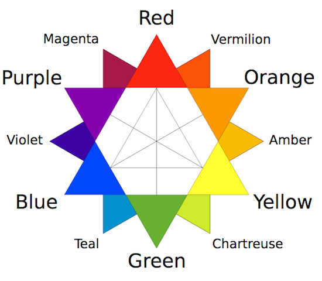
    
 Traditional color wheel 

    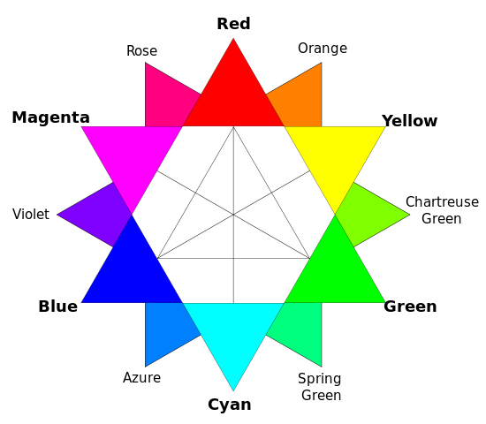
    
 RGB color wheel

### RGB [^note-id4]

RGB is a color model with three dimensions – red, green, and blue – that are mixed to produce a specific color. When defining colors in these dimensions, one has to know the sequence of colors in the color spectrum, e.g. that a mix of 100% red and green produces yellow. The RGB color model is often depicted as a cube by mapping the red, green, and blue dimensions onto the x, y, and z axis in 3D space. This is illustrated in the interactive example below, where all possible color mixes are represented within the bounds of the cube.

The RGB color model is not an especially intuitive model for creating colors in code. While you might be able to guess the combination of values to use for some colors such as yellow (equal amounts of red and green) or the red color used on Coca-Cola bottles (lots of red with a little bit of blue), less pure colors are much harder to guess in this color model. 

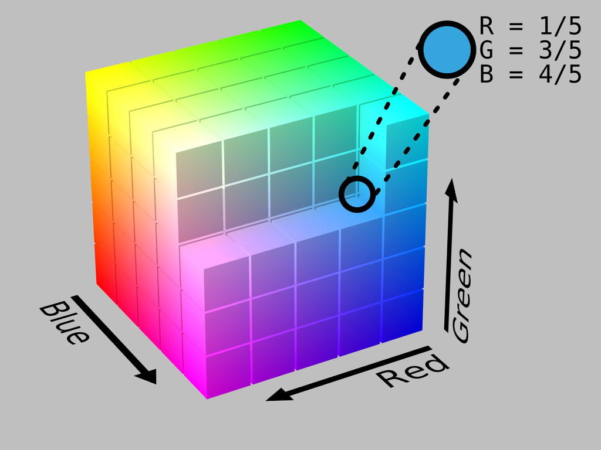

### HSV [^note-id4]

HSV is a cylindrical color model that remaps the RGB primary colors into dimensions that are easier for humans to understand. These dimensions are hue, saturation, and value.

- _Hue_ specifies the angle of the color on the RGB color circle. A 0° hue results in red, 120° results in green, and 240° results in blue.
- _Saturation_ controls the amount of color used. A color with 100% saturation will be the purest color possible, while 0% saturation yields grayscale.
- _Value_ controls the brightness of the color. A color with 0% brightness is pure black while a color with 100% brightness has no black mixed into the color. Because this dimension is often referred to as brightness, **the HSV color model is sometimes called HSB, including in P5.js.**

### HSL [^note-id4]

HSL is another cylindrical color model that shares two dimensions with HSV, while replacing the value dimension with a lightness dimension.

- _Hue_ specifies the angle of the color on the RGB color circle, exactly like HSV.
- _Saturation_ controls the purity of the color, exactly like HSV.
- _Lightness_ controls the luminosity of the color. This dimension is different from the HSV value dimension in that the purest color is positioned midway between black and white ends of the scale. A color with 0% lightness is black, 50% is the purest color possible, and 100% is white.

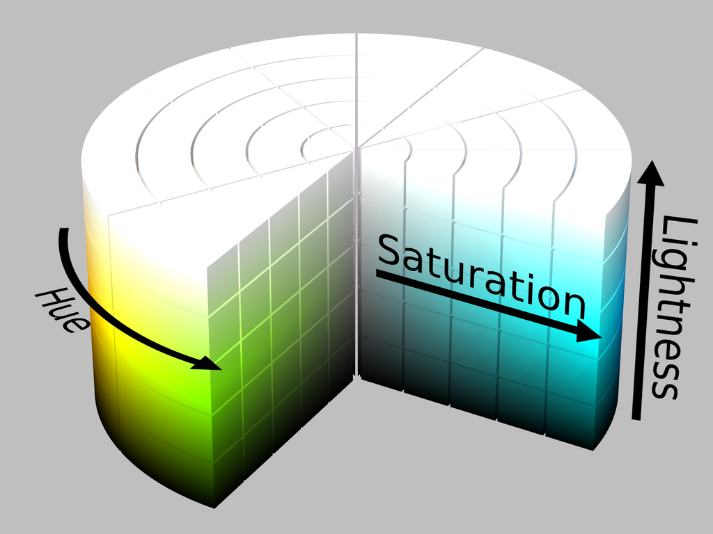

## Color spaces [^note-id4]

Color models provide for a good way to visualize the color spectrum, but they are inadequate when it comes to defining and displaying colors on computer screens. To explain this, let us assume that you own a laptop computer as well as a larger, external screen for your home office. Now, let us also assume that you are running a P5.js sketch showing a yellow ellipse on both screens. In a world without color spaces, these two screens would turn on their red and green subpixels and be done with it. However, what if your larger screen has more expensive lights that look wildly different from the ones on your laptop screen? This would result in two very different kinds of yellow. This is the problem that color spaces set out to solve.

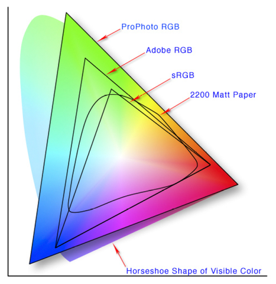

## Color Schemes [^note-id3]

### Monochromatic

    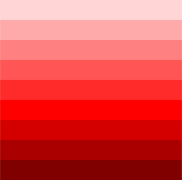
    
 
        
Monochromatic color schemes are derived from a single base hue and extended using its shades, tones and tints.

        
Tints are achieved by adding white and shades and tones are achieved by adding a darker color, grey or black.

    

### Complementary color scheme 

    

        
        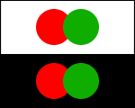        
    

    

        
Colors that are opposite each other on the color wheel are considered to be complementary colors (example: red and green).
 
        
The high contrast of complementary colors creates a vibrant look especially when used at full saturation. 

        
This color scheme must be managed well so it is not jarring. Complementary color schemes are tricky to use in large doses, but work well when you want something to stand out.

    

### Analogous color scheme 

    

        
        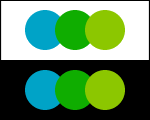        
    

    

        
Analogous color schemes use colors that are next to each other on the color wheel. They usually match well and create serene and comfortable designs. 

        
Analogous color schemes are often found in nature and are harmonious and pleasing to the eye. Make sure you have enough contrast when choosing an analogous color scheme. 

        
Choose one color to dominate, a second to support. The third color is used (along with black, white or gray) as an accent.

    

### Triadic color scheme 

    

        
        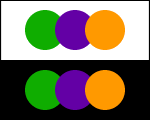        
    

    

        
A triadic color scheme uses colors that are evenly spaced around the color wheel. Triadic color schemes tend to be quite vibrant, even if you use pale or unsaturated versions of your hues. 

        
To use a triadic harmony successfully, the colors should be carefully balanced - let one color dominate and use the two others for accent.

    

### Split-Complementary color scheme 

    

        
        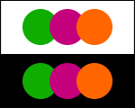        
    

    

        
The split-complementary color scheme is a variation of the complementary color scheme. In addition to the base color, it uses the two colors adjacent to its complement.
 
        
This color scheme has the same strong visual contrast as the complementary color scheme, but has less tension. The split-complimentary color scheme is often a good choice for beginners, because it is difficult to mess up.

    

### Rectangle (tetradic) color scheme 

    

        
        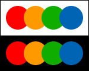        
    

    

        
The rectangle or tetradic color scheme uses four colors arranged into two complementary pairs. This rich color scheme offers plenty of possibilities for variation.

        
Tetradic color schemes works best if you let one color be dominant. You should also pay attention to the balance between warm and cool colors in your design.

    

### Square color scheme  

    

        
        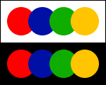        
    

    

        
The square color scheme is similar to the rectangle, but with all four colors spaced evenly around the color circle.

        
Square color schemes works best if you let one color be dominant.

        
You should also pay attention to the balance between warm and cool colors in your design.

    

### Lightness

https://programmingdesignsystems.com/color/color-schemes/index.html

## Saturation

Build an aggregator loading colour from online rep. (http://www.colourlovers.com/api)

[^note-id1]: ["Interaction of Color" - chapter 01](http://albersfoundation.org/teaching/josef-albers/interaction-of-color/publications/) Josef Albers
[^note-id2]: ["Complementary Colors"](https://en.wikipedia.org/wiki/Complementary_colors) Wikipedia
[^note-id3]: [Basic color schemes - Introduction to Color Theory](http://www.tigercolor.com/color-lab/color-theory/color-theory-intro.htm#Color_Wheel)
[^note-id4]: [Programming design systems - Color models and color spaces](https://programmingdesignsystems.com/color/color-models-and-color-spaces/)
[^note-id]: [Programming design systems - Color schemes](https://programmingdesignsystems.com/color/color-schemes/)
